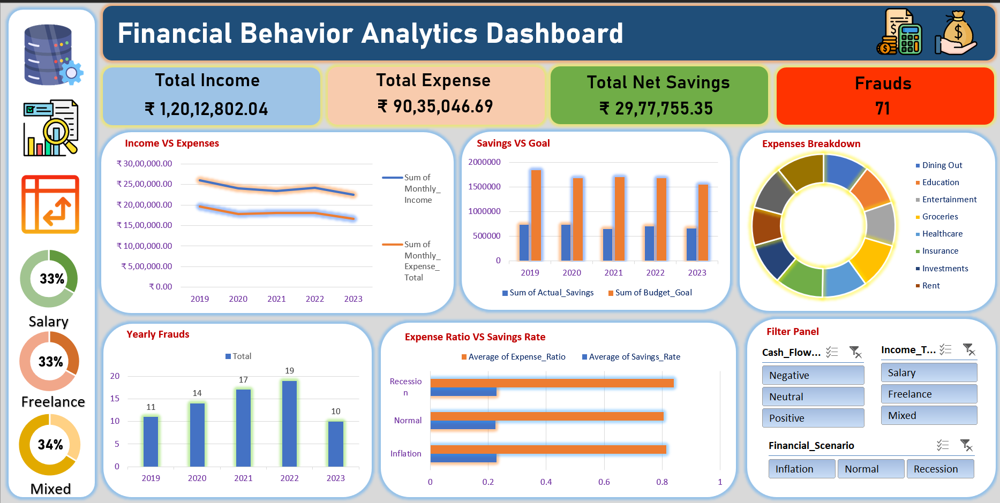
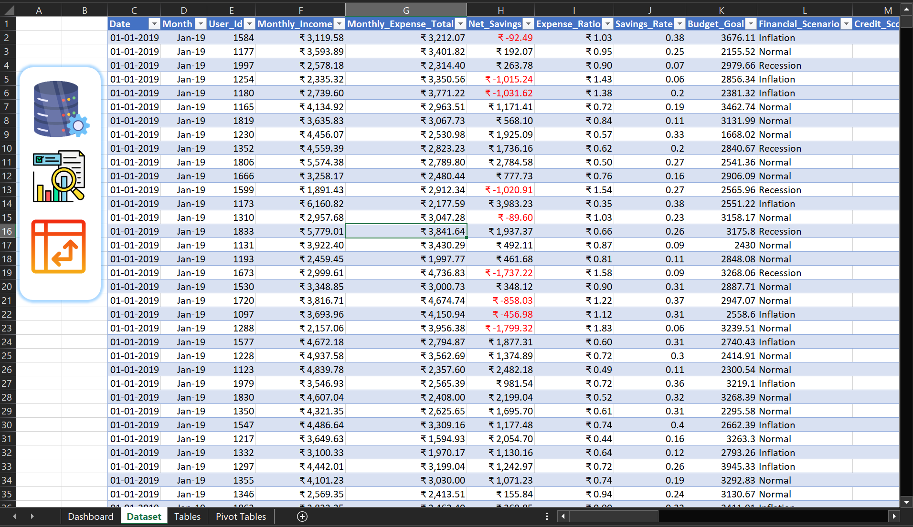
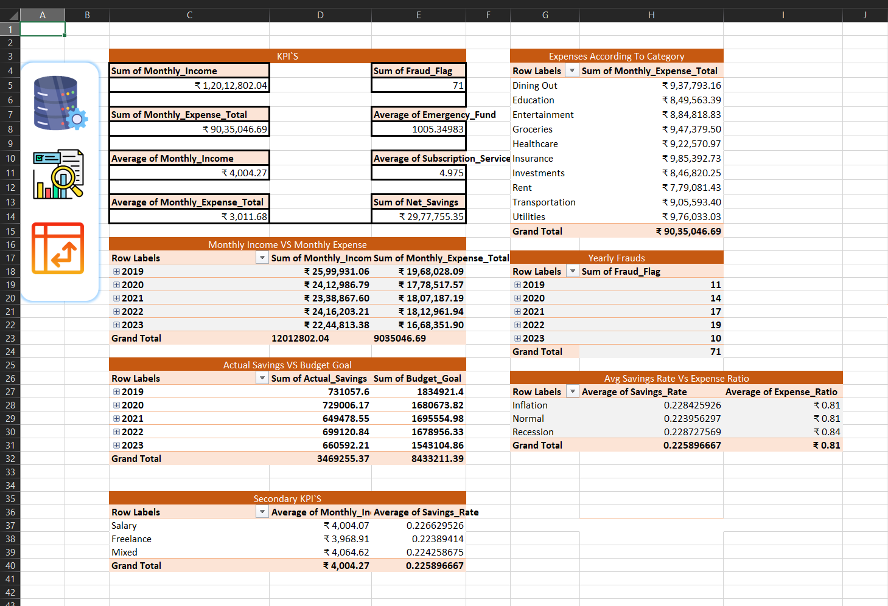

<div align="center">

# 📊 Financial Behavior Analytics Dashboard

### Interactive Excel Dashboard for Financial Performance Analysis


An interactive financial dashboard built using **Microsoft Excel** to analyze income, expenses, savings, fraud trends, and financial behavior using Pivot Tables, Pivot Charts, Slicers, and KPI Cards.

</div>

---

# 📌 Project Overview

This project transforms raw financial transaction data into a fully interactive Excel dashboard that enables users to monitor financial performance through dynamic reports and visualizations.

The dashboard provides insights into:

- 💰 Income
- 💸 Expenses
- 📈 Savings
- 🚨 Fraud Detection
- 📊 Expense Categories
- 🎯 Budget Achievement
- 📉 Financial Scenarios

---

# 🎯 Business Problem

Financial organizations generate thousands of transaction records every month. Without visualization, identifying trends, spending behavior, savings performance, and fraud becomes difficult.

This dashboard converts raw financial data into actionable insights that help decision-makers monitor financial health and make informed business decisions.

---

# 🛠️ Tools & Features

- Microsoft Excel
- Pivot Tables
- Pivot Charts
- Slicers
- Excel Tables
- GETPIVOTDATA
- Conditional Formatting
- KPI Cards
- Dynamic Dashboard
- Data Visualization

---

# 📂 Repository Structure

```
Financial-Behavior-Analytics-Dashboard
│
├── Dashboard
│   ├── Dashboard.png
│   ├── Dataset.png
│   ├── Finance Dashboard.xlsx
│   └── PivotTables.png
│
├── Images
│   ├── budget.png
│   ├── database-management.png
│   ├── gmail.png
|   ├── pivot.png
│   └── salary.png
│
└── README.md
```

---

# 📊 Dashboard Preview



---

# 📷 Dataset



---

# 📑 Pivot Tables



---

# 📈 Dashboard Components

### Income vs Expense Trend
### Expense Breakdown
### Interactive Filters

---

# 📌 Key Performance Indicators (KPIs)

| KPI | Value |
|:-----|------:|
| Total Income | ₹1,20,12,802.04 |
| Total Expense | ₹90,35,046.69 |
| Total Net Savings | ₹29,77,755.35 |
| Fraud Cases | 71 |

---

# 📊 Business Insights

## 💰 Financial Performance

- Total Income generated: **₹1.20 Crore**
- Total Expenses: **₹90.35 Lakhs**
- Net Savings: **₹29.78 Lakhs**
- Approximately **25% of total income** was retained as savings.

---

## 📈 Income vs Expense Trend

| Year | Observation |
|------|-------------|
| 2019 | Highest income recorded |
| 2020 | Income declined |
| 2021 | Stable performance |
| 2022 | Slight recovery |
| 2023 | Lowest yearly income |

---

## 🎯 Savings Analysis

Actual savings consistently remained below the planned budget goals, indicating opportunities for:

- Better budgeting
- Cost optimization
- Improved savings planning

---

## 💳 Expense Distribution

Expenses are distributed across:

- Dining
- Education
- Entertainment
- Groceries
- Healthcare
- Insurance
- Investments
- Rent
- Transportation
- Utilities

No single category dominates the overall spending pattern.

---

## 🚨 Fraud Analysis

| Year | Fraud Cases |
|------|------------:|
|2019|11|
|2020|14|
|2021|17|
|2022|19|
|2023|10|

Fraud cases increased steadily until 2022 before decreasing significantly in 2023.

---

## 📉 Financial Scenario Analysis

The dashboard compares three financial scenarios:

- Inflation
- Normal
- Recession

The **Recession** scenario recorded the highest expense ratio, indicating increased financial pressure.

---

# 🎛 Interactive Filters

Users can analyze data dynamically using:

- Cash Flow
- Income Source
- Financial Scenario

These filters allow multidimensional analysis without modifying the dataset.

---

# 📚 Excel Skills Demonstrated

- Data Cleaning
- Excel Tables
- Pivot Tables
- Pivot Charts
- GETPIVOTDATA
- Dashboard Design
- KPI Reporting
- Data Visualization
- Business Analysis
- Financial Analytics
- Interactive Reporting

---

# 🚀 Future Improvements

- Power Query Integration
- Power Pivot Data Model
- Dynamic Date Filters
- VBA Automation
- Forecasting Dashboard
- Automated Report Generation
- Power BI Version

---

# 📌 Project Outcome

This project demonstrates how Microsoft Excel can be used as a Business Intelligence tool to transform raw financial data into an interactive dashboard for monitoring financial performance, analyzing spending behavior, tracking fraud, and supporting data-driven decision-making.

---

## 👨‍💻 Author

**Onkar Patil**

Aspiring **Data Analyst**

**Skills:** Excel • SQL • Power BI • Tableau • Python

⭐ If you found this project useful, consider giving it a star!
